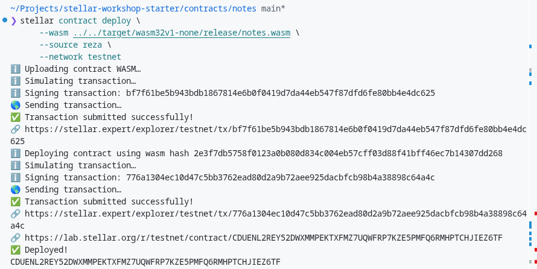
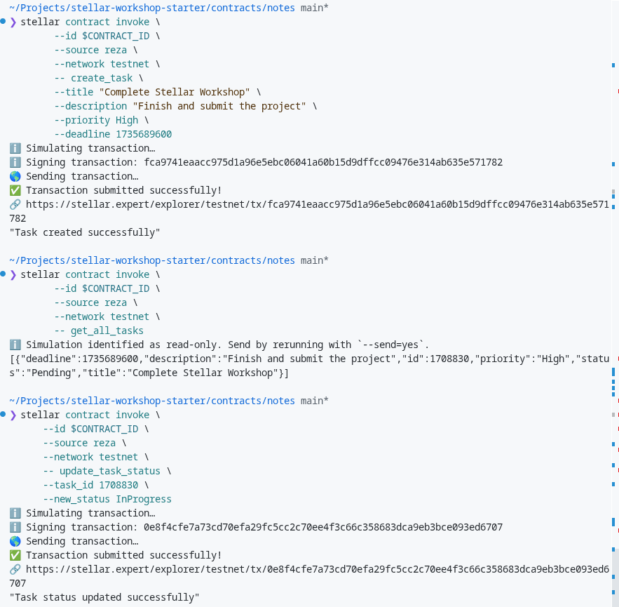

# 📝 Stellar Task Manager DApp

**A Blockchain-Based Task Management System with Priority and Status Tracking**


---

## 📖 Project Description

**Stellar Task Manager** is a decentralized application (dApp) built on the Stellar blockchain using the Soroban Smart Contract SDK. This project provides a secure, transparent, and immutable platform for managing tasks with advanced features like priority levels, status tracking, and deadline management.

Unlike traditional task management applications that rely on centralized servers and databases, this dApp stores all task data directly on the blockchain. This ensures complete data ownership, transparency, and eliminates single points of failure. Every task creation, update, and deletion is recorded immutably on the Stellar network.

The smart contract is written in Rust and leverages Soroban's efficient execution environment to provide fast, low-cost task management operations on the blockchain.

---

## ✨ Key Features

### 1. **📝 Enhanced Task Creation**

- Create tasks with title and detailed description
- Set priority levels: **High**, **Medium**, or **Low**
- Specify deadlines using Unix timestamps
- Automatic unique ID generation for each task
- Default status set to **Pending** on creation

### 2. **🔄 Smart Status Tracking**

- Three status levels: **Pending**, **InProgress**, **Completed**
- Update task status dynamically as work progresses
- Real-time synchronization with the blockchain
- Track task lifecycle from creation to completion

### 3. **⚡ Priority Management**

- Organize tasks by importance level
- High, Medium, Low priority classification
- Quick identification of critical tasks
- Better task organization and planning

### 4. **🔍 Advanced Filtering**

- Retrieve all tasks at once
- Filter tasks by specific status
- Efficient data queries
- Optimized for large task collections

### 5. **♻️ Complete Task Management**

- Full CRUD operations (Create, Read, Update, Delete)
- Update task status without recreating
- Delete completed or unnecessary tasks
- Clean and efficient storage management

### 6. **🔐 Blockchain Security**

- All data stored immutably on Stellar
- Transparent and verifiable operations
- No single point of failure
- Complete user ownership of data

---

## 🎯 Smart Contract Functions

### `create_task()`

Creates a new task with all required details.

**Parameters:**

- `title: String` - Task title
- `description: String` - Detailed task description
- `priority: Priority` - High, Medium, or Low
- `deadline: u64` - Unix timestamp for deadline

**Returns:** `String` - Success message

---

### `get_all_tasks()`

Retrieves all tasks stored in the contract.

**Parameters:** None

**Returns:** `Vec<Task>` - Vector containing all tasks

---

### `get_tasks_by_status()`

Filters and returns tasks by their current status.

**Parameters:**

- `status: Status` - Pending, InProgress, or Completed

**Returns:** `Vec<Task>` - Vector of filtered tasks

---

### `update_task_status()`

Updates the status of a specific task.

**Parameters:**

- `task_id: u64` - Unique task identifier
- `new_status: Status` - New status to set

**Returns:** `String` - Success or error message

---

### `delete_task()`

Permanently removes a task from storage.

**Parameters:**

- `task_id: u64` - ID of the task to delete

**Returns:** `String` - Success or error message

---

## 🏗️ Data Structure

```rust
// Task structure
pub struct Task {
    pub id: u64,                // Unique identifier
    pub title: String,          // Task title
    pub description: String,    // Detailed description
    pub priority: Priority,     // High/Medium/Low
    pub status: Status,         // Pending/InProgress/Completed
    pub deadline: u64,          // Unix timestamp
}

// Priority enumeration
pub enum Priority {
    High,
    Medium,
    Low,
}

// Status enumeration
pub enum Status {
    Pending,
    InProgress,
    Completed,
}
```

---

## 🌐 Contract Details

- **Contract ID**: `REPLACE_WITH_YOUR_CONTRACT_ID_AFTER_DEPLOYMENT`
- **Network**: Stellar Testnet
- **Blockchain**: Stellar
- **SDK**: Soroban v25
- **Language**: Rust

---

## 📸 Screenshots

### Contract Deployment on Testnet


_Successfully deployed contract showing Contract ID_

### Task Creation and Management


_Creating and managing tasks on Stellar testnet_

---

## 🚀 Getting Started

### Prerequisites

- Rust toolchain (1.75+)
- Stellar CLI
- Soroban SDK v25

### Installation

1. **Clone the repository**

```bash
git clone https://github.com/yourusername/stellar-task-manager.git
cd stellar-task-manager
```

2. **Build the smart contract**

```bash
cd contracts/notes
stellar contract build
```

3. **Run tests**

```bash
cargo test
```

Expected output:

```
running 5 tests
test test::test_create_task ... ok
test test::test_delete_task ... ok
test test::test_delete_nonexistent_task ... ok
test test::test_get_tasks_by_status ... ok
test test::test_update_task_status ... ok

test result: ok. 5 passed
```

---

## 📦 Deployment to Testnet

### Step 1: Generate Wallet

```bash
stellar keys generate alice --network testnet
```

### Step 2: Fund Wallet

```bash
stellar keys fund alice --network testnet
```

### Step 3: Deploy Contract

```bash
stellar contract deploy \
  --wasm target/wasm32v1-none/release/notes.wasm \
  --source alice \
  --network testnet
```

Save the returned Contract ID!

---

## 💻 Usage Examples

### Create a Task

```bash
stellar contract invoke \
  --id YOUR_CONTRACT_ID \
  --source alice \
  --network testnet \
  -- create_task \
  --title "Complete Stellar Workshop" \
  --description "Finish and submit the project" \
  --priority High \
  --deadline 1735689600
```

### Get All Tasks

```bash
stellar contract invoke \
  --id YOUR_CONTRACT_ID \
  --source alice \
  --network testnet \
  -- get_all_tasks
```

### Update Task Status

```bash
stellar contract invoke \
  --id YOUR_CONTRACT_ID \
  --source alice \
  --network testnet \
  -- update_task_status \
  --task_id 123456 \
  --new_status InProgress
```

### Filter by Status

```bash
stellar contract invoke \
  --id YOUR_CONTRACT_ID \
  --source alice \
  --network testnet \
  -- get_tasks_by_status \
  --status Completed
```

### Delete a Task

```bash
stellar contract invoke \
  --id YOUR_CONTRACT_ID \
  --source alice \
  --network testnet \
  -- delete_task \
  --task_id 123456
```

---

## 🧪 Testing

The contract includes comprehensive test coverage:

```bash
cargo test
```

**Test Cases:**

- ✅ Task creation with all fields
- ✅ Retrieving all tasks
- ✅ Filtering tasks by status
- ✅ Updating task status
- ✅ Deleting tasks
- ✅ Error handling for non-existent tasks

---

## 🆚 Comparison with Traditional Systems

| Feature          | Traditional Apps    | Stellar Task Manager     |
| ---------------- | ------------------- | ------------------------ |
| **Data Storage** | Centralized servers | Blockchain (distributed) |
| **Ownership**    | Company owns data   | User owns data           |
| **Transparency** | Opaque backend      | Fully transparent        |
| **Censorship**   | Can be censored     | Censorship-resistant     |
| **Downtime**     | Server dependent    | Always available         |
| **Trust Model**  | Trust the company   | Trust the code           |
| **Costs**        | Subscription fees   | Low gas fees only        |

---

## 🎓 Why This Project is Different

This project goes beyond the basic Notes example from the workshop by adding:

1. ✅ **Priority Levels** - High, Medium, Low classification
2. ✅ **Status Tracking** - Pending, InProgress, Completed states
3. ✅ **Update Functionality** - Modify task status without recreation
4. ✅ **Advanced Filtering** - Query tasks by status
5. ✅ **Deadline Management** - Time-based task tracking
6. ✅ **Enhanced Data Model** - More complex and useful structure
7. ✅ **Real-World Use Case** - Practical productivity application

---

## 🔮 Future Enhancements

### Phase 1: Core Improvements

- 📧 Email reminders for approaching deadlines
- 🏷️ Tags and categories for better organization
- 📊 Task analytics and productivity dashboard
- 🔍 Advanced search and filtering

### Phase 2: Collaboration

- 👥 Multi-user task sharing with permissions
- 💬 Task comments and discussions
- 🔔 Real-time notifications
- 🌐 Web-based frontend interface

### Phase 3: Advanced Features

- 🤖 AI-powered task suggestions
- 📎 IPFS integration for file attachments
- 🔗 Cross-chain compatibility
- 🔐 Zero-knowledge privacy features

---

## 🛠️ Technical Stack

- **Blockchain**: Stellar Network
- **Smart Contract Platform**: Soroban
- **Programming Language**: Rust
- **SDK Version**: Soroban SDK v25
- **Network**: Testnet (upgradeable to Mainnet)

---

## 📄 License

This project is licensed under the MIT License.

---

## 👨‍💻 Author

Built for **Build On Stellar Workshop Indonesia** by Rise In

---

## 🔗 Links

- 🌐 [Stellar Network](https://stellar.org)
- 📚 [Soroban Documentation](https://soroban.stellar.org)
- 🔍 [Stellar Testnet Explorer](https://stellar.expert/explorer/testnet)
- 💬 [Stellar Community Discord](https://discord.gg/stellar)

---

## 🙏 Acknowledgments

Special thanks to:

- Rise In Indonesia for organizing the workshop
- Stellar Development Foundation for the amazing technology
- The Soroban developer community

---

**Stellar Task Manager** - Decentralizing Productivity, One Task at a Time 🚀
